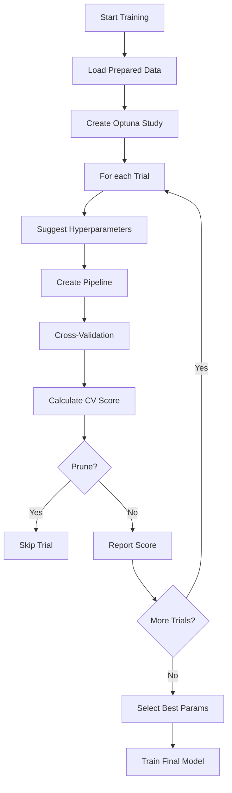

# Cách Huấn Luyện Các Mô Hình và Kết Hợp Chúng

## 🎯 Tổng Quan Huấn Luyện

Dự án sử dụng **Optuna** framework để tối ưu hyperparameters cho 5 mô hình machine learning. Tất cả models kế thừa từ `BaseModelTrainer` để đảm bảo tính nhất quán và tái sử dụng code.

## 🏗️ Kiến Trúc Base Trainer

**File**: `src/models/base_trainer.py`

### BaseModelTrainer Class

```python
class BaseModelTrainer(ABC):
    """
    Abstract base class cho tất cả model trainers
    """
    def __init__(self, model_name, use_scaler=True):
        self.model_name = model_name
        self.use_scaler = use_scaler
    
    @abstractmethod
    def suggest_hyperparameters(self, trial):
        """Suggest hyperparameters cho Optuna trial"""
        pass
    
    @abstractmethod
    def create_pipeline(self, classifier_params):
        """Create sklearn Pipeline"""
        pass
    
    def train(self, n_trials=None, timeout=None):
        """Main training method với Optuna optimization"""
        # 1. Load data
        # 2. Create Optuna study
        # 3. Optimize hyperparameters
        # 4. Train final model
        # 5. Evaluate
        # 6. Save model
```

## 🔧 Quy Trình Huấn Luyện

### Phase 1: Hyperparameter Optimization



### Phase 2: Final Model Training

```
Best Hyperparameters
    ↓
Create Pipeline với best params
    ↓
Train trên Full Train Set (56,000 samples)
    ↓
Evaluate trên Test Set (14,000 samples)
    ↓
Save Model + Encoders
```

## 📊 Chi Tiết Từng Mô Hình

### 1. **KNN (K-Nearest Neighbors)**

**File**: `src/models/knn.py`

**Hyperparameters**:
- `n_neighbors`: 3-30 (step 3)
- `weights`: 'uniform' hoặc 'distance'
- `metric`: 'euclidean', 'manhattan', 'minkowski', 'chebyshev'
- `algorithm`: 'auto' (fixed)
- `n_jobs`: -1 (all cores)
- Feature Selection:
  - `use_feature_selection`: True/False
  - `feature_selection_method`: 'selectkbest' hoặc 'pca'
  - `n_features`: 15-40 (SelectKBest) hoặc 0.85-0.98 variance (PCA)

**Pipeline**:
```
StandardScaler → [SelectKBest/PCA] → KNeighborsClassifier
```

**Optuna Trials**: 45

**Đặc điểm**:
- Distance-based → cần StandardScaler
- Feature selection quan trọng để giảm noise
- Fast training, good baseline

### 2. **Naive Bayes**

**File**: `src/models/naive_bayes.py`

**Hyperparameters**:
- `nb_variant`: 'gaussian', 'multinomial', 'complement', 'bernoulli'
- `var_smoothing`: 1e-9 - 1e-5 (GaussianNB)
- `alpha`: 0.1-5.0 (Multinomial/Complement/Bernoulli)
- `fit_prior`: True/False
- `binarize`: 0.0-0.5 (BernoulliNB)

**Pipeline**:
```
StandardScaler → GaussianNB/MultinomialNB/etc.
```

**Optuna Trials**: 40

**Đặc điểm**:
- Handle both continuous & discrete features
- Fast training and prediction
- Support multiple variants for different data distributions

### 6. **LightGBM**

**File**: `src/models/lightgbm.py`

**Hyperparameters**:
- `n_estimators`: 200-1000
- `num_leaves`: 31-127
- `max_depth`: 4-12
- `learning_rate`: 0.01-0.3
- `feature_fraction`: 0.7-1.0
- `bagging_fraction`: 0.7-1.0
- `boosting_type`: 'gbdt', 'dart', 'goss'

**Pipeline**:
```
LGBMClassifier (no scaler needed)
```

**Optuna Trials**: 40

**Đặc điểm**:
- Faster than XGBoost (histogram-based)
- Efficient memory usage
- Native categorical feature support

### 3. **Random Forest**

**File**: `src/models/random_forest.py`

**Hyperparameters**:
- `n_estimators`: 100-1000 (step 50)
- `max_depth`: 5-40 hoặc None (unlimited)
- `max_features`: 'sqrt', 'log2', None, 0.5-0.9
- `min_samples_split`: 2-20 (step 2)
- `min_samples_leaf`: 1-10
- `criterion`: 'gini', 'entropy', 'log_loss'
- `bootstrap`: True/False
- `max_samples`: 0.6-1.0 (nếu bootstrap=True)
- `class_weight`: None hoặc 'balanced'
- `n_jobs`: -1 (all cores)

**Pipeline**:
```
RandomForestClassifier (no scaler needed)
```

**Optuna Trials**: 40

**Đặc điểm**:
- Tree-based → không cần StandardScaler
- Robust với overfitting
- Feature importance available
- Parallel training với n_jobs=-1

### 4. **Logistic Regression**

**File**: `src/models/logistic_regression.py`

**Hyperparameters**:
- `use_polynomial_features`: True/False
- `polynomial_degree`: 2 (fixed)
- `interaction_only`: True/False
- `include_bias`: True/False
- `penalty`: 'l1', 'l2', 'elasticnet', 'none'
- `C`: 0.01-100 (log scale)
- `solver`: 'liblinear', 'lbfgs', 'newton-cg', 'saga'
- `max_iter`: 2000-5000
- `tol`: 1e-5-1e-3 (log scale)
- `class_weight`: None hoặc 'balanced'
- `l1_ratio`: 0.1-0.9 (nếu elasticnet)
- `n_jobs`: -1 (nếu solver != 'liblinear')

**Pipeline**:
```
StandardScaler → [PolynomialFeatures] → [SelectKBest] → LogisticRegression
```

**Optuna Trials**: 35

**Đặc điểm**:
- Polynomial features (degree 2) để capture interactions
- Feature selection sau polynomial để giảm memory
- Solver selection dựa trên penalty type
- Interpretable model

### 5. **XGBoost**

**File**: `src/models/xgboost.py`

**Hyperparameters**:
- `n_estimators`: 100-1200 (step 50)
- `max_depth`: 3-12
- `learning_rate`: 0.005-0.5 (log scale)
- `subsample`: 0.5-1.0
- `colsample_bytree`: 0.5-1.0
- `colsample_bylevel`: 0.5-1.0
- `colsample_bynode`: 0.5-1.0
- `min_child_weight`: 1-15
- `gamma`: 0-10
- `reg_alpha`: 0-20
- `reg_lambda`: 0-20
- `tree_method`: 'hist' hoặc 'approx'
- `booster`: 'gbtree' hoặc 'dart'
- DART parameters (nếu booster='dart'):
  - `sample_type`: 'uniform' hoặc 'weighted'
  - `normalize_type`: 'tree' hoặc 'forest'
  - `rate_drop`: 0.0-0.5
  - `skip_drop`: 0.0-0.5
- `n_jobs`: 1 (sequential để tránh deadlock)

**Pipeline**:
```
XGBClassifier (no scaler needed)
```

**Optuna Trials**: 30

**Đặc điểm**:
- Tree-based → không cần StandardScaler
- Dynamic num_class detection (13 classes)
- Sequential Optuna trials để tránh deadlock
- Most powerful model, best performance

## 🎯 Optuna Configuration

### Study Setup

```python
study = optuna.create_study(
    direction='maximize',  # Maximize CV score
    sampler=TPESampler(
        seed=42,
        n_startup_trials=10,
        multivariate=True,
        constant_liar=True
    ),
    pruner=MedianPruner(
        n_startup_trials=8,
        n_warmup_steps=5,  # CV folds
        interval_steps=1
    )
)
```

### Optimization

```python
study.optimize(
    lambda trial: self._objective(trial, X_train, y_train),
    n_trials=n_trials,  # Model-specific
    timeout=timeout,    # None = no timeout
    n_jobs=1,           # Sequential để tránh quá tải
    show_progress_bar=True
)
```

### Objective Function

```python
def _objective(self, trial, X_train, y_train):
    # 1. Suggest hyperparameters
    params = self.suggest_hyperparameters(trial)
    
    # 2. Create pipeline
    pipeline = self.create_pipeline(params)
    
    # 3. Cross-validation
    cv = StratifiedKFold(n_splits=5, shuffle=True, random_state=42)
    scores = []
    
    for fold_idx, (train_idx, val_idx) in enumerate(cv.split(X_train, y_train)):
        # Train on fold
        pipeline.fit(X_train[train_idx], y_train[train_idx])
        
        # Predict on validation
        pred = pipeline.predict(X_train[val_idx])
        
        # Calculate score
        score = precision_score(y_train[val_idx], pred, average='macro')
        scores.append(score)
        
        # Report for pruning
        trial.report(score, fold_idx)
        if trial.should_prune():
            raise optuna.TrialPruned()
    
    # Return mean CV score
    return np.mean(scores)
```

## 🔄 Cross-Validation Strategy

**Method**: StratifiedKFold với 5 folds

**Đặc điểm**:
- **Stratified**: Giữ class distribution trong mỗi fold
- **Shuffle**: True (randomize)
- **Random State**: 42 (reproducibility)

**Process**:
```
Train Set (56,000 samples)
    ↓
Split into 5 folds (11,200 samples each)
    ↓
For each fold:
    - Train on 4 folds (44,800 samples)
    - Validate on 1 fold (11,200 samples)
    ↓
5 CV scores → Mean CV score
```

## 🎯 Model Evaluation

**Metrics**:
- **Accuracy**: Overall correctness
- **F1-Score (Macro)**: Average F1 across all classes
- **F1-Score (Weighted)**: Weighted F1 by class frequency
- **Precision (Macro)**: Primary optimization metric

**Evaluation Process**:
```python
# Train final model on full train set
final_model = create_pipeline(best_params)
final_model.fit(X_train, y_train)

# Evaluate on test set
y_pred = final_model.predict(X_test)

# Calculate metrics
accuracy = accuracy_score(y_test, y_pred)
f1_macro = f1_score(y_test, y_pred, average='macro')
f1_weighted = f1_score(y_test, y_pred, average='weighted')
```

## 🔗 Kết Hợp Models (Ensemble)

**File**: `src/prediction/predictor.py`

### Weighted Voting Strategy

```python
def prediction(user_data, return_details=False):
    # Load all 5 models
    models = {
        'knn': load_model('knn'),
        'naive_bayes': load_model('naive_bayes'),
        'randomforest': load_model('randomforest'),
        'logistic': load_model('logistic'),
        'xgboost': load_model('xgboost'),
        'lightgbm': load_model('lightgbm')
    }
    
    # Weights
    weights = {
        'knn': 45,
        'logistic': 75,
        'randomforest': 90,
        'naive_bayes': 82,
        'xgboost': 90,
        'lightgbm': 91
    }
    
    # Get predictions from all models
    predictions = {}
    for model_name, model in models.items():
        pred = model.predict(user_data)[0]
        predictions[model_name] = pred
    
    # Weighted voting
    vote_counts = {}
    for model_name, pred in predictions.items():
        weight = weights[model_name]
        if pred not in vote_counts:
            vote_counts[pred] = 0
        vote_counts[pred] += weight
    
    # Select prediction with highest weighted votes
    final_prediction = max(vote_counts.items(), key=lambda x: x[1])[0]
    
    return final_prediction
```

### Ensemble Benefits

1. **Robustness**: Giảm overfitting của từng model
2. **Accuracy**: Kết hợp strengths của nhiều models
3. **Reliability**: Nếu 1 model fail, các models khác vẫn hoạt động
4. **Performance**: Weighted voting tận dụng models tốt nhất

## 🚀 Training All Models

### Models
 
 - **K-Nearest Neighbors (KNN)** - Feature selection and dimensionality reduction optimized
 - **Naive Bayes** - Support for Gaussian, Multinomial, and Bernoulli variants
 - **Random Forest** - Out-of-bag scoring and feature importance analysis
 - **Logistic Regression** - Polynomial features and interaction terms
 - **XGBoost** - Dynamic class detection and monotonic constraints
 - **LightGBM** - Gradient boosting with efficient histogram-based algorithms

**File**: `src/train_all_models.py`

### Sequential Training

```python
python src/train_all_models.py
```

**Process**:
1. KNN → Train & Save
2. Naive Bayes → Train & Save
3. Random Forest → Train & Save
4. Logistic Regression → Train & Save
5. XGBoost → Train & Save
6. LightGBM → Train & Save

**Benefits**:
- Data cache sharing (chỉ load 1 lần)
- Sequential resource usage
- Easy debugging

### Parallel Training (Optional)

```python
python src/train_all_models.py --parallel --max-workers 3
```

**Note**: Không khuyến khích vì:
- Không share data cache
- Quá tải tài nguyên
- Khó debug

## 📊 Training Results

**Saved Files** (cho mỗi model):
- `{model_name}_model.pkl` - Trained model
- `{model_name}_encoders.pkl` - Feature encoders
- `{model_name}_label_encoder.pkl` - Target encoder
- `{model_name}_heatmap.png` - Confusion matrix visualization

**Location**: `models/{model_name}/`

## ⚙️ Resource Management

**Threading Configuration**:
- **OpenBLAS/MKL**: Limited to min(CPU cores/2, 8)
- **Model n_jobs**: -1 (all cores) cho KNN, RF, LR
- **XGBoost n_jobs**: 1 (tránh deadlock)
- **Optuna n_jobs**: 1 (sequential trials)

**Memory Management**:
- Data caching để tránh reload
- Feature selection để giảm memory footprint
- Polynomial features limited to degree 2

## 🎯 Best Practices

1. **Always use caching**: `use_cache=True` trong `get_prepared_data()`
2. **Sequential Optuna**: `n_jobs=1` để tránh quá tải
3. **Error handling**: Return 0.0 thay vì raise RuntimeError
4. **Validation**: Check empty folds, invalid scores
5. **Logging**: Centralized logging với file output

