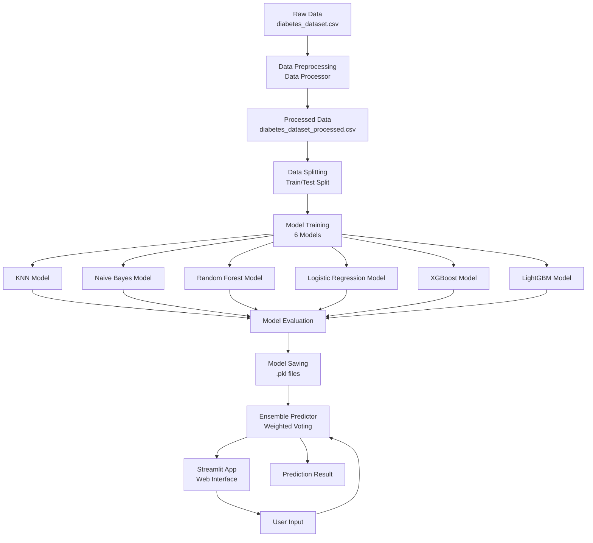

# Tổng Hợp Pipeline Dự Án - Diabetes Assessment and Prediction

## 📋 Tổng Quan

Dự án **Diabetes Assessment and Prediction** là một hệ thống machine learning hoàn chỉnh để dự đoán các loại bệnh tiểu đường dựa trên các đặc điểm lâm sàng và dữ liệu bệnh nhân. Dự án sử dụng 5 mô hình học máy khác nhau và kết hợp chúng bằng phương pháp ensemble voting.

## 🔄 Pipeline Tổng Thể



## 📊 Kiến Trúc Hệ Thống

### 1. **Data Layer** (Lớp Dữ Liệu)
```
data/
├── raw/
│   └── diabetes_dataset.csv          # Dữ liệu thô ban đầu
└── processed/
    └── diabetes_dataset_processed.csv # Dữ liệu đã xử lý
```

### 2. **Preprocessing Layer** (Lớp Tiền Xử Lý)
- **Input**: Raw CSV file
- **Process**: 
  - Encoding categorical features (OneHotEncoder)
  - Handling missing values
  - Feature engineering
  - Data validation
- **Output**: Processed CSV file với 58 features + Target

### 3. **Model Training Layer** (Lớp Huấn Luyện)
- **Base Trainer**: `BaseModelTrainer` - Abstract class cho tất cả models
- **6 Model Trainers**:
  1. `KNNTrainer` - K-Nearest Neighbors
  2. `NaiveBayesTrainer` - Naive Bayes
  3. `RandomForestTrainer` - Random Forest
  4. `LogisticRegressionTrainer` - Logistic Regression
  5. `XGBoostTrainer` - XGBoost
  6. `LightGBMTrainer` - LightGBM

### 4. **Optimization Layer** (Lớp Tối Ưu)
- **Framework**: Optuna với TPE Sampler
- **Strategy**: 
  - Sequential trials (`n_jobs=1`) để tránh quá tải
  - Model-specific trial counts
  - Cross-validation với StratifiedKFold (5 folds)
  - Pruning với MedianPruner

### 5. **Prediction Layer** (Lớp Dự Đoán)
- **Ensemble Method**: Weighted Voting
- **Models**: 5 trained models
- **Weights**: 
  - KNN: 45
  - Logistic Regression: 75
  - Random Forest: 90
  - Naive Bayes: 82
  - XGBoost: 90
  - LightGBM: 91

### 6. **Application Layer** (Lớp Ứng Dụng)
- **Framework**: Streamlit
- **Location**: `app/deploy.py`
- **Features**: 
  - Form input cho user data
  - Real-time prediction
  - Result visualization

## 🔀 Luồng Dữ Liệu Chi Tiết

### Phase 1: Data Preparation
```
Raw Data (70,000 rows, 59 columns)
    ↓
[Data Validation]
    ↓
[Missing Value Handling]
    ↓
[Categorical Encoding]
    ↓
[Feature Engineering]
    ↓
Processed Data (70,000 rows, 59 columns)
    ↓
[Train/Test Split: 80/20]
    ↓
Train Set: 56,000 samples
Test Set: 14,000 samples
```

### Phase 2: Model Training
```
For each model:
    ↓
[Load Prepared Data]
    ↓
[Optuna Study Creation]
    ↓
[Hyperparameter Optimization]
    ├── Trial 1 → CV Score
    ├── Trial 2 → CV Score
    ├── ...
    └── Trial N → CV Score
    ↓
[Best Hyperparameters Selected]
    ↓
[Final Model Training on Full Train Set]
    ↓
[Model Evaluation on Test Set]
    ↓
[Save Model + Encoders]
```

### Phase 3: Prediction
```
User Input Data (1 row)
    ↓
[Preprocessing with Saved Encoders]
    ↓
[Feature Alignment]
    ↓
[5 Model Predictions]
    ├── KNN → Prediction 1
    ├── SVM → Prediction 2
    ├── Random Forest → Prediction 3
    ├── Logistic Regression → Prediction 4
    └── XGBoost → Prediction 5
    ↓
[Weighted Voting]
    ↓
Final Prediction
```

## 📁 Cấu Trúc Thư Mục

```
Diabetes-Assessment-and-Prediction/
├── data/
│   ├── raw/                    # Dữ liệu thô
│   └── processed/              # Dữ liệu đã xử lý
├── src/
│   ├── preprocessing/          # Tiền xử lý dữ liệu
│   ├── models/                 # Model trainers
│   ├── prediction/             # Prediction module
│   ├── utils.py                # Utility functions
│   ├── config.py               # Configuration
│   └── train_all_models.py    # Training script
├── models/                     # Saved models
│   ├── knn/
│   ├── naive_bayes/
│   ├── random_forest/
│   ├── logistic_regression/
│   ├── xgboost/
│   └── lightgbm/
├── results/                    # Evaluation results
├── app/
│   └── deploy.py              # Streamlit app
└── report/                    # Documentation
```

## 🔧 Công Nghệ Sử Dụng

- **Language**: Python 3.12
- **ML Frameworks**: 
  - scikit-learn
  - XGBoost
  - Optuna (Hyperparameter Optimization)
- **Data Processing**: 
  - pandas
  - numpy
- **Visualization**: 
  - matplotlib
  - Streamlit
- **Model Persistence**: joblib

## ⚙️ Cấu Hình Chính

- **Random State**: 42 (đảm bảo reproducibility)
- **Test Size**: 20% (14,000 samples)
- **CV Folds**: 5 (StratifiedKFold)
- **Scoring Metric**: Precision (macro average)
- **Optuna Trials**: Model-specific (20-45 trials)
- **Optuna Jobs**: 1 (sequential để tránh quá tải)

## 🎯 Mục Tiêu Dự Án

1. **Dự đoán chính xác** loại bệnh tiểu đường từ 13 classes
2. **Tối ưu hóa hyperparameters** cho từng model
3. **Kết hợp nhiều models** để tăng độ chính xác
4. **Cung cấp giao diện web** dễ sử dụng cho end-users

## 📈 Performance Metrics

- **Accuracy**: Tỷ lệ dự đoán đúng tổng thể
- **F1-Score (Macro)**: Trung bình F1-score cho tất cả classes
- **F1-Score (Weighted)**: F1-score có trọng số theo số lượng samples
- **Precision (Macro)**: Metric chính cho optimization

## 🔄 Workflow Tổng Thể

1. **Data Collection** → Raw dataset
2. **Data Preprocessing** → Clean, encode, validate
3. **Model Training** → 5 models với Optuna optimization
4. **Model Evaluation** → Test set evaluation
5. **Model Deployment** → Save models và encoders
6. **Application Development** → Streamlit web app
7. **Prediction Service** → Ensemble prediction với weighted voting

