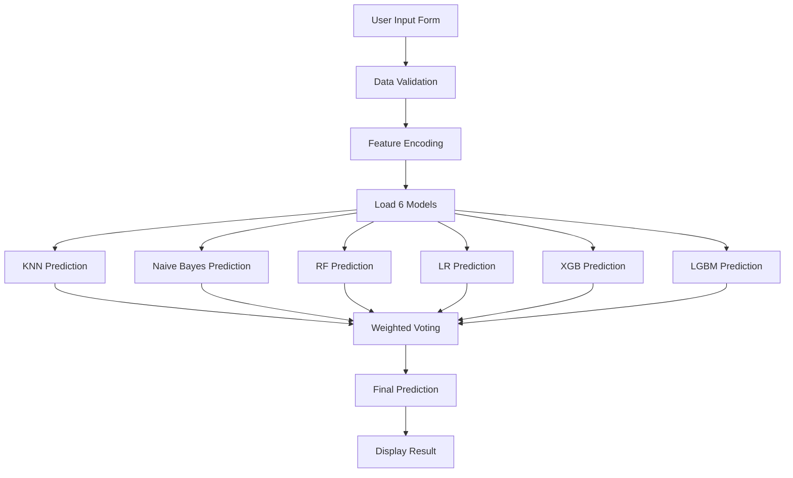

# Tổng Hợp Kết Quả và Cách Sử Dụng Dự Án

## 📊 Tổng Hợp Kết Quả Các Models

### Model Performance Summary

*Note: Các thông số này sẽ được cập nhật sau khi training hoàn tất*

| Model | Accuracy | F1-Macro | F1-Weighted | Best CV Score | Training Time |
|-------|----------|----------|-------------|---------------|---------------|
| KNN | 45.34% | 0.4529 | 0.4531 | - | - |
| Naive Bayes | 82.32% | 0.8229 | 0.8230 | - | - |
| Random Forest | 90.40% | 0.9031 | 0.9030 | - | - |
| Logistic Regression | 75.41% | 0.7533 | 0.7536 | - | - |
| XGBoost | 89.91% | 0.8982 | 0.8982 | - | - |
| LightGBM | 90.76% | 0.9065 | 0.9064 | - | - |
| **Ensemble** | *TBD* | *TBD* | *TBD* | - | - |

### Model Weights trong Ensemble

- **KNN**: 45
- **Logistic Regression**: 75
- **Random Forest**: 90
- **Naive Bayes**: 82
- **XGBoost**: 90
- **LightGBM**: 91

*Weights được chọn dựa trên performance và reliability của từng model*

## 📁 Cấu Trúc Kết Quả

### Saved Models

```
models/
├── knn/
│   ├── knn_model.pkl
│   ├── knn_encoders.pkl
│   └── knn_label_encoder.pkl
├── naive_bayes/
│   ├── naivebayes_model.pkl
│   ├── naivebayes_encoders.pkl
│   └── naivebayes_label_encoder.pkl
├── random_forest/
│   ├── randomforest_model.pkl
│   ├── randomforest_encoders.pkl
│   └── randomforest_label_encoder.pkl
├── logistic_regression/
│   ├── logisticregression_model.pkl
│   ├── logistic_encoders.pkl
│   └── logistic_label_encoder.pkl
├── xgboost/
│   ├── xgboost_model.pkl
│   ├── xgboost_encoders.pkl
│   └── xgboost_label_encoder.pkl
└── lightgbm/
    ├── lightgbm_model.pkl
    ├── lightgbm_encoders.pkl
    └── lightgbm_label_encoder.pkl
```

### Evaluation Results

```
results/
├── knn_heatmap.png              # Confusion matrix
├── naive_bayes_heatmap.png
├── randomforest_heatmap.png
├── logistic_heatmap.png
├── xgboost_heatmap.png
└── lightgbm_heatmap.png
```

### Training Logs

```
training_YYYYMMDD_HHMMSS.log     # Training logs với timestamps
```

## 🚀 Cách Sử Dụng Dự Án

### 1. **Cài Đặt Dependencies**

```bash
pip install -r requirements.txt
```

**Main Dependencies**:
- pandas, numpy
- scikit-learn
- xgboost
- optuna
- streamlit
- matplotlib
- joblib

### 2. **Training Models**

#### Option 1: Train Tất Cả Models

```bash
python src/train_all_models.py
```

**Tính năng**:
- Train tuần tự 5 models
- Sử dụng số trials từ config
- Tự động save models và results
- Generate confusion matrix heatmaps

#### Option 2: Train Model Cụ Thể

```bash
# Train KNN
python src/models/knn.py

# Train Naive Bayes
python src/models/naive_bayes.py

# Train Random Forest
python src/models/random_forest.py

# Train Logistic Regression
python src/models/logistic_regression.py

# Train XGBoost
python src/models/xgboost.py

# Train LightGBM
python src/models/lightgbm.py
```

#### Option 3: Custom Trials

```bash
python src/train_all_models.py --n-trials 50
```

### 3. **Chạy Streamlit Application**

#### Khởi Động App

```bash
streamlit run app/deploy.py
```

**Hoặc**:

```bash
cd app
streamlit run deploy.py
```

#### Sử Dụng Web Interface

1. **Mở trình duyệt**: App sẽ tự động mở tại `http://localhost:8501`

2. **Điền Form**:
   - **Demographic Information**: Age, BMI, Ethnicity, etc.
   - **Clinical Data**: Blood Pressure, Cholesterol, Blood Glucose, etc.
   - **Genetic Factors**: Genetic Markers, Autoantibodies, Family History
   - **Lifestyle**: Physical Activity, Dietary Habits, Smoking, Alcohol
   - **Medical History**: PCOS, Gestational Diabetes, Pregnancy History
   - **Test Results**: Glucose Tolerance Test, Liver Function, etc.
   - **Condition-Specific**: Cystic Fibrosis, Pancreatic Health, etc.

3. **Nhận Kết Quả**:
   - **Predicted Diabetes Type**: Kết quả dự đoán từ ensemble
   - **Confidence Score**: Độ tin cậy của prediction
   - **Individual Model Predictions**: Kết quả từ từng model (nếu có)

### 4. **Sử Dụng Prediction API**

**File**: `src/prediction/predictor.py`

```python
from src.prediction.predictor import prediction
import pandas as pd

# Prepare user data
user_data = pd.DataFrame({
    'Age': [45],
    'BMI': [28.5],
    'Blood Pressure': [140],
    # ... other features
})

# Get prediction
result = prediction(user_data, return_details=True)

# Result structure
{
    'prediction': 'Type 2 Diabetes',
    'confidence': 0.85,
    'individual_predictions': {
        'knn': 'Type 2 Diabetes',
        'naive_bayes': 'Type 2 Diabetes',
        'randomforest': 'Type 2 Diabetes',
        'logistic': 'Type 2 Diabetes',
        'xgboost': 'Type 2 Diabetes',
        'lightgbm': 'Type 2 Diabetes'
    },
    'vote_counts': {
        'Type 2 Diabetes': 380  # Sum of weights
    }
}
```

## 📋 Input Requirements

### Required Features (58 features)

**Demographic**:
- Age (numeric)
- BMI (numeric)
- Ethnicity (categorical)
- Socioeconomic Factors (categorical)

**Clinical**:
- Blood Pressure (numeric)
- Cholesterol Levels (numeric)
- Blood Glucose Levels (numeric)
- Waist Circumference (numeric)
- Insulin Levels (numeric)

**Genetic**:
- Genetic Markers (categorical: Positive/Negative)
- Autoantibodies (categorical: Positive/Negative)
- Family History (categorical: Yes/No)

**Lifestyle**:
- Physical Activity (categorical: High/Medium/Low)
- Dietary Habits (categorical: Healthy/Moderate/Unhealthy)
- Smoking Status (categorical: Smoker/Non-smoker)
- Alcohol Consumption (categorical: High/Medium/Low/None)

**Medical History**:
- History of PCOS (categorical: Yes/No)
- Previous Gestational Diabetes (categorical: Yes/No)
- Pregnancy History (categorical)
- Weight Gain During Pregnancy (numeric)

**Test Results**:
- Glucose Tolerance Test (categorical: Normal/Abnormal)
- Liver Function Tests (categorical: Normal/Abnormal)
- Urine Test (categorical: Normal/Abnormal)
- Neurological Assessments (numeric)

**Condition-Specific**:
- Cystic Fibrosis Diagnosis (categorical: Yes/No)
- Pancreatic Health (numeric)
- Pulmonary Function (numeric)
- Steroid Use History (categorical: Yes/No)
- Genetic Testing (categorical: Positive/Negative)
- Digestive Enzyme Levels (numeric)
- Birth Weight (numeric)
- Environmental Factors (categorical: Present/Absent)

## 🎯 Prediction Workflow



## 📊 Evaluation Metrics Explained

### Accuracy
Tỷ lệ dự đoán đúng tổng thể trên test set.

**Formula**: `(Correct Predictions) / (Total Predictions)`

### F1-Score (Macro)
Trung bình F1-score cho tất cả 13 classes (không có trọng số).

**Formula**: `Mean(F1_class1, F1_class2, ..., F1_class13)`

**Use Case**: Đánh giá performance trên tất cả classes, không quan tâm class imbalance.

### F1-Score (Weighted)
F1-score có trọng số theo số lượng samples của mỗi class.

**Formula**: `Sum(F1_class_i * weight_i) / Sum(weight_i)`

**Use Case**: Đánh giá performance có tính đến class imbalance.

### Precision (Macro)
Metric chính cho optimization - trung bình precision cho tất cả classes.

**Formula**: `Mean(Precision_class1, Precision_class2, ..., Precision_class13)`

## 🔍 Confusion Matrix

Mỗi model có confusion matrix được lưu trong `results/` folder.

**File Format**: PNG image với heatmap visualization

**Interpretation**:
- **Diagonal**: Correct predictions
- **Off-diagonal**: Misclassifications
- **Color intensity**: Number of samples

## 📝 Logging

### Training Logs

**Location**: Root directory với format `training_YYYYMMDD_HHMMSS.log`

**Contents**:
- Training progress
- Best hyperparameters
- CV scores
- Evaluation metrics
- Errors và warnings

### Console Output

- Real-time progress bars (Optuna)
- Trial information
- Best trial updates
- Completion status

## 🛠️ Troubleshooting

### Model Not Found

**Error**: `FileNotFoundError: Model file not found`

**Solution**:
```bash
# Train models first
python src/train_all_models.py
```

### Missing Encoders

**Error**: `KeyError: Encoder not found`

**Solution**: Đảm bảo cả 3 files được save:
- `{model}_model.pkl`
- `{model}_encoders.pkl`
- `{model}_label_encoder.pkl`

### Memory Issues

**Error**: `MemoryError`

**Solution**:
- Giảm số trials trong config
- Giảm polynomial degree (Logistic Regression)
- Giảm n_estimators (Random Forest, XGBoost)
- Sử dụng feature selection

### OpenBLAS Warning

**Warning**: `OpenBLAS NUM_THREADS exceeded`

**Solution**: Đã được fix trong `train_all_models.py` - tự động limit threads.

## 📈 Performance Optimization Tips

1. **Use Caching**: Data được cache tự động
2. **Sequential Training**: Train models tuần tự để share cache
3. **Resource Limits**: Threads được tự động limit
4. **Feature Selection**: Sử dụng cho KNN và Logistic Regression
5. **Early Stopping**: Optuna pruning để skip bad trials

## 🔄 Updating Results

Sau khi training hoàn tất, cập nhật bảng performance summary ở đầu file này với:
- Actual accuracy scores
- F1-scores (macro và weighted)
- Best CV scores
- Training times
- Best hyperparameters (nếu cần)

## 📞 Support

Nếu gặp vấn đề:
1. Kiểm tra logs trong `training_*.log`
2. Verify models đã được train
3. Check dependencies đã install đầy đủ
4. Review error messages trong console

